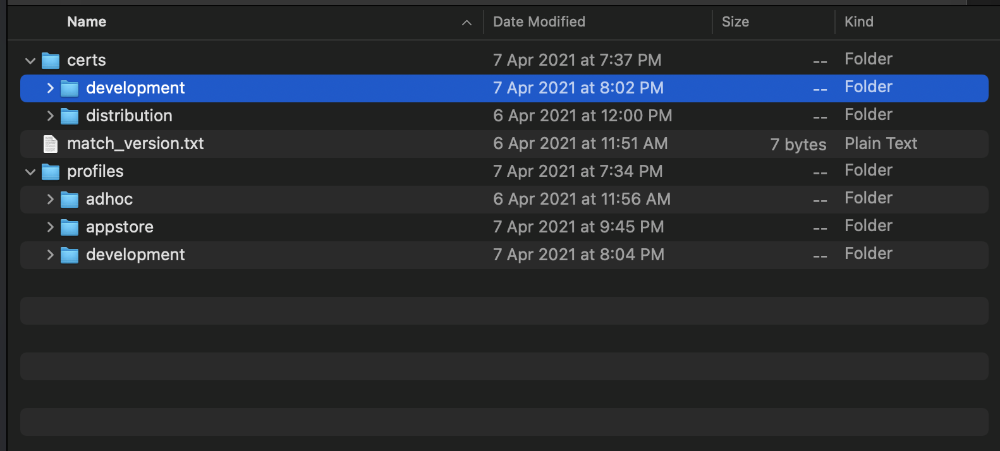

# Description
Continuous integration and either continuous delivery or continuous deployment steps using Fastlane and Bitrise in iOS projects 🚀 🤝.
## Installation
- First of all you need to manage ruby version across development team and different machines using [rbenv](https://github.com/rbenv/rbenv).
    - Any mac machine  has a Local ruby version use `ruby -v` to detect it, We will work with services that interact with ruby version,
       So we need to install another ruby version in project directory it will be use across development team.
    - Install rbenv using `Homebrew` and go to project directory and install another ruby version using `rbenv local 2.6.5` for example 
- Make sure of gems (Cocoapods, Fastlane) version across development team using [bundler](https://bundler.io/).
    - Bundler is an exit from dependency hell, and ensures that the gems you need are present in development, staging, and production. 
    - Go to project directory and instal it using `gem install bundler -v 2.1.4` for example.
    - Use `bundler init` for determin gems version in our projects.
        - It will generate <strong> Gemfile </strong>.
            - ```ruby
                # frozen_string_literal: true

                source "https://rubygems.org"

                git_source(:github) {|repo_name| "https://github.com/#{repo_name}" }

                 gem "cocoapods", "1.10.0"
                 gem "fastlane", "2.171.0"

                plugins_path = File.join(File.dirname(__FILE__), 'fastlane', 'Pluginfile')
                eval_gemfile(plugins_path) if File.exist?(plugins_path)
                ```
    - Use `bundle install` for install specific version of our gems.
        - Any one clone our project and run `bundle install` that will install specific version of our gems.
    - Every time you will use gem use `bundle exec` before gem command.
        - for example in Cocoapods gem instead of using `pod init` we will use `bundle exec pod init`.
## Setup Project Environment 
- Setup project environments, schemes and schemes configurations (Production - Development - Testing).
    - Production environment usually use for distribute app for '`pp-store`.
    - Testing environment use for distribute app for tester using `Adhoc`.
    - Development environment use for development our features.
    - Every environment has two schemes configurations (debug - release).
        - debuge need a development provisioning profile and release need either Adhoc or appstore provisioning profile.
## Setup Fastlane
- Setup [Fastlane ](http://fastlane.tools/)tool and this is the middle man 🕵 between our project and any continuous integration cloud server.
    - Add fastlane gem with specific version to gemfile and use `bundle install`.
    - Use `bundle exec fastlane init` to generate <strong>Fastfile and Appfile.</strong>. 
        - Appfile: Contains global configurations of our project for example (bundle identifier, team id and apple id).
            - ```ruby
                app_identifier("cyour app identifier") 
                 # Your Apple email address
                apple_id(" your apple id")
                team_name "team name "
                team_id "team id"
                ```
        - fastfile: Contains our lanes to automate specific develoment tasks.
 - Setup [Match Action ](http://docs.fastlane.tools/actions/match/#match).
    - Share one code signing identity across your development team to simplify your codesigning setup and prevent code signing issues.
    -  Use `bundle exec fastlane match init` to generate  match file is a configuration file to match action.
       - Add <Strong> git_url,storage_mode and (true) </Strong>
        -  git_url: git private repository url that contains our certificates and provisioning profiles
        -  storage_mode: `git` or `bitbucket` for example
            - ``` ruby 
                git_url("your private repo url")

                storage_mode("git")
                ```
   - Preferred To run `match nuke `command to revoke your certificates and provisioning profiles pefore manage app signing.
    - There is two ways to setup match action <strong> Manually or Automatically</strong>. 
        - ## Match Manually Setup
            - Add app identifer and generate certificates and profiles for development, adhoc and app-store (for each scheme) in apple portal.
            - Open Xcode and make manual select for provisioning profiles and set it manually by generated ones.
            - Add and set to true readonly property in `match file` to tell fastlane you will generate certificates and provisioning profiles manually.
               - ``` ruby
                  git_url("your private repo url")
                     
                   storage_mode("git")
                     
                   readonly(true)
                   ```
         
            - Match needd cer file and  private key(.p12 file) to install certificates in aother machines.
            - Export .p12 file from keychain.
            - When you export p12 file don’t insert any password.
            - Rename cer file and p12 file with certificate id.
            - Rename Provisioning profile with  type_bundleId.mobileprovision for example .
                - AdHoc_com.your app bundle id.mobileprovision
            - Encripte certificates using ssh -> (openssl enc -aes-256-cbc -k) 
                - openssl enc  -aes-256-cbc -k "your password" -in "certificateId.cer" -out "certificateId.new.cer" -a -e -salt 
            - Encripte Provisioning profile using ssh -> (openssl enc -aes-256-cbc -k).
            - Clone certificate repo and add group structure.
            - Add folder with name 'certs' and another folder with name 'profiles' and add file match_version.txt.
                - match_version : Contain match version for example 2.171.0
                - <p align="center">
                     
                  </p>
               
       - ## Match Automatically Setup
            - Simple as that 😄
            - ``` ruby
                lane :beta do
                # generate certificate and Provisioning profile for appstore
                match(type: "appstore",
                app_identifier: "tools.fastlane.app")
                
                # generate certificate and Provisioning profile for development
                match(type: "development",
                app_identifier: "tools.fastlane.app")

                # generate certificate and Provisioning profile for adhoc
                match(type: "adhoc",
                      app_identifier: "tools.fastlane.app")

                 end
                 ```
 
 ## Fastlane Usage
  - ## [Snapshot Action ](https://docs.fastlane.tools/getting-started/ios/screenshots/)
    - Using `terminal`, navigate to your project directory and initialise snapshot Using `bundle exec fastlane snapshot init`.
    - Once you run this command fastlane will create two files in your project directory, <Strong> Snapfile and SnapshotHelper.swift </Strong>.
    - Set your devices and languages in  <Strong> Snapfile </Strong>. One important thing you’ll have to do is to set the scheme name that will run the UI tests.
    - snapshot is actually using UI tests to create your screenshots. It will run a UI test on your app and all you have to do is tell it when to take the               screenshot and how to name it.
    - Add <Strong> SnapshotHelper.swift </Strong> To UITest target and make sure you’ve set the target membership correctly for <Strong> SnapshotHelper.swift             </Strong>.
    - Add UI Test Scheme In order to be able to run the new target we’ll need a new scheme. So go on and create one, And Once you’ve created the scheme, you’ll          have to edit it
    - Make sure that your scheme is set to build and run ✅
    - Create new class that implement `XCTestCase` protocol
    - Add code below in setup method
        - ``` swift
            override func setUp() {
              let app = XCUIApplication()
              setupSnapshot(app)
              app.launch()
             }
          ```
    - Add a test function, And if you click inside the body of the function a little red record button will become enabled
    - When you click the ‘record’ button your app will start. From this point on Xcode will record all the actions you take in your app. Make sure you navigate to      the screens that you want to grab screenshots for. 
    - As you’re navigating through the app you’ll see that this function will be populated by code. As the code is being populated remember the places where you         want screenshots taken, When you’re finished navigating through the app stop recording
    - Finally Add call `bundle exec fastlane snapshot`
  - ## Fastfile Example
    - Example of use 
    - [Produce ](http://docs.fastlane.tools/actions/produce/#produce) 
    - [Cocoapods ](http://docs.fastlane.tools/actions/cocoapods/#cocoapods) 
    - [Increment_build_number ](http://docs.fastlane.tools/actions/increment_build_number/#increment_build_number) 
    - [Gym ](http://docs.fastlane.tools/actions/gym/#gym) 
    - [Precheck ](http://docs.fastlane.tools/actions/precheck/#precheck) 
    - [Pilot ](http://docs.fastlane.tools/actions/pilot/#pilot) 
    - [deliver ](http://docs.fastlane.tools/actions/deliver/#deliver)
    - [firebase_app_distribution ](http://docs.fastlane.tools/plugins/available-plugins/#firebase_app_distribution)
    - ``` ruby
        # This file contains the fastlane.tools configuration
        # You can find the documentation at https://docs.fastlane.tools
        #
        # For a list of all available actions, check out
        #
        #     https://docs.fastlane.tools/actions
        #
        # For a list of all available plugins, check out
        #
        #     https://docs.fastlane.tools/plugins/available-plugins
        #

        # Uncomment the line if you want fastlane to automatically update itself
        # update_fastlane

        default_platform(:ios)

        platform :ios do


          lane :register_app do
            produce
          end

          desc "Sync team Code-Signing assets"
          lane :sync_signing_assets do |options|
            selectedType = options[:type]
            identifier = options[:app_identifier]

            match(type: selectedType, app_identifier: identifier)
          end

          desc "Build for App Store submission"
          lane :build_appstore do
            #install cocapods

            cocoapods(clean_install: true)

            # install certificates

            sync_signing_assets(type: "appstore", app_identifier: "app_identifier")

            #  increment build number
            increment_build_number

            # archive app using gym
            gym(
              output_directory: "build_AppStore",
              export_method: "app-store"
              )

             #take app screen shots
            snapshot
          end

          desc "Build for Ad Hoc submission"
          lane :build_adhoc do
            #install cocapods

            cocoapods(clean_install: true)

            # install certificates

            sync_signing_assets(type: "adhoc", app_identifier: "app_identifier")


            # archive app using gym
            gym(
            output_directory: "build_AdHoc",
            export_method: "ad-hoc"
            )
            #  increment build number
            increment_build_number

            #take app screen shots
            snapshot

            firebase_app_distribution(
              firebase_cli_token: "firebase login ci token",
              app: "firebase app id",
              testers: "tester@gmail.com",
              release_notes: "Lots of amazing new features to test out for movie 🍿"
          )

            end


            desc "precheck for meta data and violations rules"
            lane :check_metadata do
              precheck
            end

            desc "upload ipa version to upload_testflight testflight" 
            lane :upload_testflight do 
                 # call pilot
                  pilot(
                          app_platform: 'ios',
                          ipa: "relative path of ipa"
                        )
            end


            desc "deliver uploads screenshots, metadata and binaries to App Store Connect. Use deliver to submit your app for App Store review."
            lane :submit_app do
              deliver(
                ipa: "elative path of ipa",
                submit_for_review: true,
                force: true
              )
            end
        end
      ```
 ## Bitrise 🤖
  - Bitrise is a Continuous Integration and Delivery (CI/CD) Platform as a Service (PaaS) with a main focus on mobile app development (iOS, Android, React Native,      Flutter, and so on)، It is a collection of tools and services to help you with the development and automation of your software projects.
## Setup Bitrise
  - Create a new app on Bitrise.
    - Click “Add your first app” button.
    - Click “Add your first app” button.
    - Connect the repository.
    - Choose a branch, That will run your workflow on it.
 - Setup repository access
    - If your app depend on another private repository you need to generate a publich ssh key and put in your GitHub account
        - not this is a tricky part to access private repos you can go [Match](http://docs.fastlane.tools/actions/match/#match) to resolve problems 
 - Validate your app
    - Choose a workspace app name.
    - Choose a scheme name.
    - Select ipa export method.
    - Choose the stack that you want to run your app.
        - You Should select the stack same as Xcode and macOS version that you use already on your local machine.
        - When you finished from setup your app in bitrise go to <Strong> workflow_editor -> stack </Strong> to match Xcode and macOS versions same as local                 machine.
        - click on More (information about this Stack ) to match ruby and bundler version same as local machine.
     - <p align="center">
         
        </p>
- Registers a webhook for you
    - We have a three webhooks in bitrise
        - Push webhook.
        - Tag webhook.
        - Pull request webhook.
     
- Finsh setup app 🎉.
  
## Setup Workflow Editor.

   - There are 2 workflows by default: 
   
   - Primary: This is the default workflow that allows you to clone your app from the repo, installs Cocoapods/Carthage if needed, runs your app and your unit/UI      tests.
   - Deploy: Use this workflow if you want to deploy your app to the iTunes Connect (TestFlight or App Store).
   - The picture above demonstrates how Workflow Editor looks like. You can edit or remove the steps or create a new one or reorder them. Adding or configuring a       step is so easy and fun!
   - Click any “plus” button between the steps, you will see all the steps that you can add to your workflow. If you want to see only iOS/macOS tools, click the         Apple icon from the top-right of the screen.
   - When you use fastlane and match action to signing your app you need to insert your password in "Env_Vars" or "Secret"  with key "MATCH_PASSWORD".
       - <p align="center">
             
          </p > 
   - Workflow examples
       - 

## Triggers.
 - Responsible for run your builds to automate your development process, this is mean when someone makes a push or (pull request ) to the “development” branch (or    which branch you want), trigger "primary" workflow.
 
 - <p align="center">
     
    </p >


